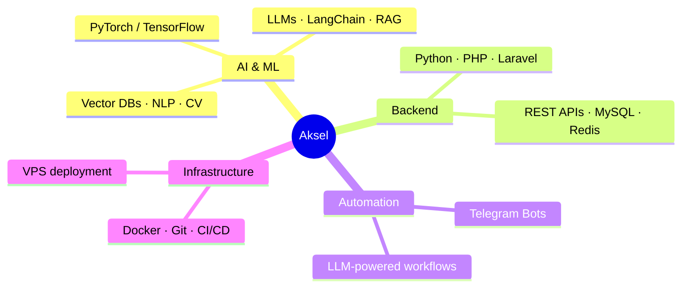
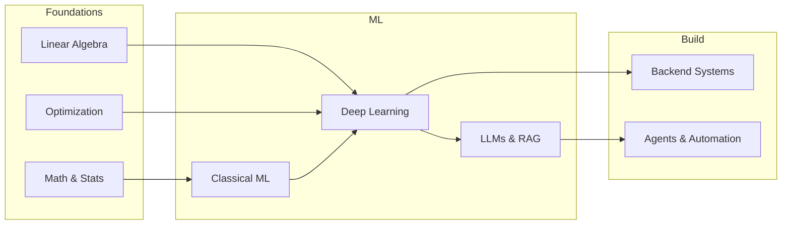
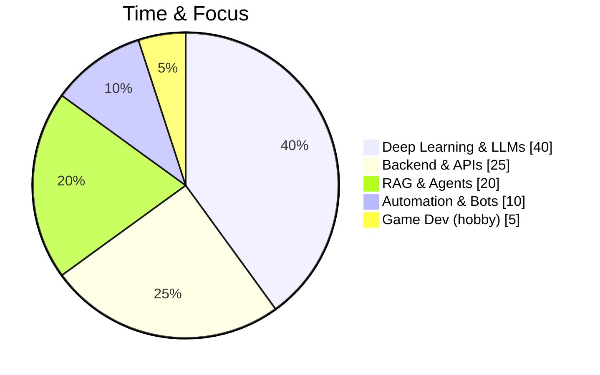

# Aksel Aghajanyan

**AI Research · Deep Learning · Backend Engineering**

*Building intelligent systems with strong foundations in mathematics, ML, and software engineering*

---

## About Me

I'm **Aksel**, an AI research student and backend developer from **Armenia**. I focus on understanding and building intelligent systems—from scalable backends to LLMs and agents—with an emphasis on **how things work under the hood**, not only high-level APIs.

**Current focus:** Deep learning (PyTorch, TensorFlow), LLMs & RAG, intelligent automation, and system design.

---

## Tech Stack & Focus

---

## Learning Path

| Area | Technologies & Topics |
|------|------------------------|
| **AI / ML** | PyTorch, TensorFlow, LLaMA, OpenAI API, LangChain, RAG, Qdrant, Pinecone, Weaviate |
| **Core ML** | Regression, classification, k-NN, SVM, trees, boosting, CNNs, RNNs, LSTMs, GANs |
| **Backend** | Python, PHP, Laravel, REST APIs, MVC, MySQL, MongoDB, Redis |
| **DevOps** | Git, GitHub, Docker, CI/CD, VPS deployment |
| **Automation** | Telegram bots (Python, pyTelegramBotAPI), LLM integration, contextual memory |
| **GPU** | CUDA basics, Triton, TensorRT (exploration) |
| **Hobby** | Unreal Engine 5, Blueprints, C++, AI behavior trees, game prototyping |

---

## Current Focus

---

## AqwelAl

Founder of **AqwelAl** — an early-stage initiative around:

- AI experimentation and learning  
- Intelligent automation tools  
- Open-source Python utilities  

---

## How I Work

> **Learn the fundamentals. Build with purpose. Improve continuously.**

- Prefer understanding model internals and system design over only using APIs  
- Use games and simulations as a sandbox for AI and systems thinking  
- Interested in the intersection of **AI research, agents, automation, and system-level design**  

---

### Connect

