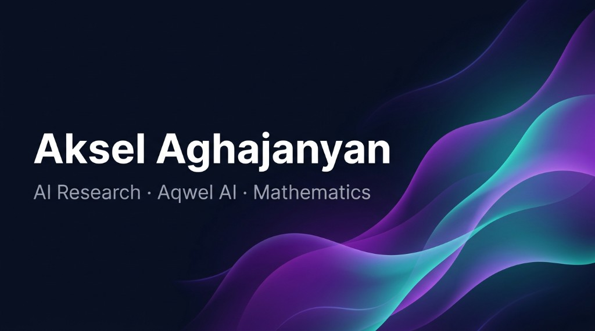

# Aksel Aghajanyan

**AI Research Student · Backend Developer · Founder of Aqwel AI**

*Developing [Aion](https://github.com/AkseL588) (Open Research Toolkit) · Focused on Mathematics & Intelligent Systems*

---

## About

Hi, I'm **Aksel**, an AI research student and deep learning developer from **Armenia**, focused on understanding and building intelligent systems grounded in strong mathematical and engineering foundations.

I am particularly interested in **deep learning** and **large language models**, and in learning how advanced AI systems are trained, optimized, and deployed efficiently.

**Top skills:** Python · Artificial Intelligence · Machine Learning · Deep Learning · Data Science

---

## AI & Machine Learning — Learning Path (In Progress)

- Python for AI development, automation, and APIs  
- Advanced Python programming for AI systems  
- Data & scientific stack: **NumPy, Pandas, Matplotlib, Seaborn, SciPy**, Jupyter  
- Deep learning with **PyTorch** and **TensorFlow**  
- Large Language Models (LLMs): **LLaMA, OpenAI API, LangChain**  
- Retrieval-Augmented Generation (RAG) systems  
- Vector databases: **Qdrant, Pinecone, Weaviate**  
- Prompt engineering and intelligent agent design  
- Core ML: **scikit-learn**, regression, classification, k-NN, SVM, decision trees, ensemble methods, gradient boosting  
- Neural networks: **CNNs, RNNs, LSTMs**, generative models (GANs)  
- Fundamentals of **NLP** and **computer vision**  
- Data science: EDA, pipelines, model evaluation and optimization  
- GPU acceleration: **CUDA, Triton, TensorRT** (exploration)  

> My focus is on understanding **how and why** models work, not only using high-level tools.

---

## Data Science

- **NumPy** — numerical computing, arrays, linear algebra  
- **Pandas** — data manipulation, cleaning, analysis, time series  
- **Matplotlib** & **Seaborn** — visualization, EDA, statistical plots  
- **SciPy** — scientific computing, optimization, statistics  
- **scikit-learn** — preprocessing, model selection, evaluation, pipelines  
- **Jupyter** — interactive notebooks for analysis and experimentation  
- Exploratory data analysis (EDA), feature engineering, model evaluation  
- Statistics, hypothesis testing, and communicating insights  

---

## Automation & Bots

- Telegram bots with **Python** and `pyTelegramBotAPI`  
- LLM integration for intelligent automation  
- Real-time message handling with contextual memory  

---

## Research Interests & Long-Term Vision

- Artificial intelligence and intelligent agents  
- Deep learning and large language models  
- Mathematics for AI and optimization  
- GPU-accelerated computing and efficient inference  
- Building reliable, scalable AI-backed systems  

---

## Game Development (Hobby)

Game development is a personal interest and experimental space.

- **Unreal Engine 5** (Blueprints, basic C++)  
- Gameplay prototyping and environment design  
- AI behavior trees, cutscenes, cinematic tools  
- Using games as a sandbox for AI, simulation, and systems thinking  

---

## Founder — Aqwel AI

Founder of **[Aqwel AI](https://aqwelai.xyz)**, an early-stage initiative focused on learning, experimentation, and open development of **AI-powered tools**.

- AI experimentation and learning  
- Intelligent automation  
- Open research & tooling (e.g. **Aion**)  

**Website:** [aqwelai.xyz](https://aqwelai.xyz)  

---

## Newsletter — Aksel with AI

[**Aksel with AI**](https://akselwithai.xyz) — where I share my vision of building future AI tools and my startup journey with Aqwel AI. From technical deep dives to product and research updates.

*Published weekly · 130+ subscribers*

---

## Articles

- [**The Geometry of the Double Descent: How Overparameterized Models Learn Beyond Classical Limits**](https://medium.com/frontiers-of-data-science/the-geometry-of-the-double-descent-how-overparameterized-models-learn-beyond-classical-limits-10fbbaee56ff) — *Frontiers of Data Science*
- [**Why Mathematical Reasoning Exposes the Limits of AI**](https://medium.com/@AkselAghajanyan/why-mathematical-reasoning-exposes-the-limits-of-ai-437ded440936)
- [**Why Bigger Models Don't Automatically Mean Smarter AI**](https://medium.com/@AkselAghajanyan/why-bigger-models-dont-automatically-mean-smarter-ai-fcdbb0789ea6)

---

git a## Let's connect

Open to **research collaboration**, **internships**, and **ML engineering** opportunities. Happy to discuss AI, deep learning, or building intelligent systems.

Reach out via [LinkedIn](https://linkedin.com/in/aksel-aghajanyan) or [email](mailto:akseldeveloper8@gmail.com).

---

### Connect

