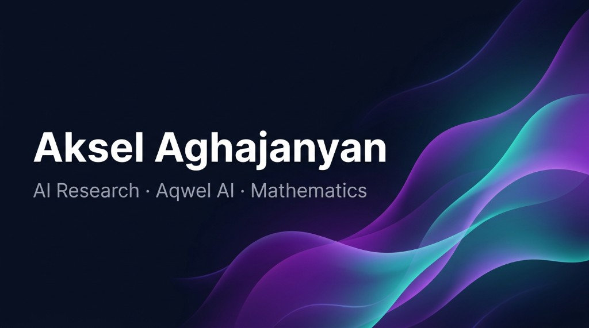

# Aksel Aghajanyan

**Data Scientist & ML Researcher | Founder of Aqwel AI | Working on Applied ML and Mathematical Modeling**

*Also building [Aion](https://github.com/AkseL588) (Open Research Toolkit).*

---

## About

Hi, I'm **Aksel**, a data scientist and ML researcher from **Armenia**, focused on applied machine learning, mathematical modeling, and intelligent systems grounded in strong mathematical and engineering foundations.

I am particularly interested in **deep learning**, **large language models**, and how advanced AI systems are trained, optimized, and deployed efficiently.

I write **scientific articles** on [Medium](https://medium.com/@AkselAghajanyan) and enjoy **reading**, **studying**, and **doing research**—especially at the intersection of mathematics, ML theory, and intelligent systems.

**Top skills:** Python · Artificial Intelligence · Machine Learning · Deep Learning · Data Science

---

## Articles

[Medium](https://medium.com/@AkselAghajanyan) — AI, ML theory, math.

- [Double descent & overparameterization](https://medium.com/frontiers-of-data-science/the-geometry-of-the-double-descent-how-overparameterized-models-learn-beyond-classical-limits-10fbbaee56ff) · *Frontiers of Data Science*
- [Random matrix theory in ML](https://medium.com/frontiers-of-data-science/random-matrix-theory-visualizing-mathematics-and-its-applications-in-machine-learning-45aaf14fe829) · *Frontiers of Data Science*
- [Mathematical reasoning & limits of AI](https://medium.com/@AkselAghajanyan/why-mathematical-reasoning-exposes-the-limits-of-ai-437ded440936)
- [Bigger models ≠ smarter AI](https://medium.com/@AkselAghajanyan/why-bigger-models-dont-automatically-mean-smarter-ai-fcdbb0789ea6)

---

## AI & Machine Learning — Learning Path (In Progress)

Python · NumPy/Pandas stack · **PyTorch** · **TensorFlow** · LLMs (LLaMA, APIs, LangChain) · RAG · **Qdrant / Pinecone / Weaviate** · classical ML & **scikit-learn** · CNNs, RNNs, LSTMs, GANs · NLP & CV · **CUDA / Triton / TensorRT** (exploration) · *focus: how & why models work*

---

## Data Science

**NumPy** · **Pandas** · **Matplotlib** / **Seaborn** · **SciPy** · **scikit-learn** · **Jupyter** · EDA · feature engineering · stats & hypothesis testing

---

## Mathematics for AI / ML / DS — In Progress

Linear algebra · probability & statistics · calculus & gradients · optimization · random matrix theory · information theory · discrete math & logic

---

## Automation & Bots

**Python** · Telegram (`pyTelegramBotAPI`) · LLM automation · contextual memory

---

## Prompt Engineering

Structured & few/zero-shot prompts · RAG-style prompting · agents · **OpenAI** · **Anthropic** · **LangChain**

---

## Research Interests & Long-Term Vision

Agents · DL & LLMs · math for AI · GPU inference · reliable, scalable AI systems

---

## Game Development (Hobby)

**Unreal Engine 5** · Blueprints / C++ · prototyping · AI behavior trees · AI & systems sandbox

---

## Founder — Aqwel AI

**[Aqwel AI](https://aqwelai.xyz)** — learning, experimentation, open **AI-powered tools** · automation · research & tooling (**Aion**)

---

## Newsletter — Aksel with AI

[**Aksel with AI**](https://akselwithai.xyz) — where I share my vision of building future AI tools and my startup journey with Aqwel AI. From technical deep dives to product and research updates.

*Published weekly · 130+ subscribers*

---

## Let's connect

Open to **research collaboration**, **internships**, and **ML engineering** opportunities. Happy to discuss AI, deep learning, or building intelligent systems.

Reach out via [LinkedIn](https://linkedin.com/in/aksel-aghajanyan).

---

> *Learn the fundamentals. Build with purpose. Improve continuously.*

---

### Connect

